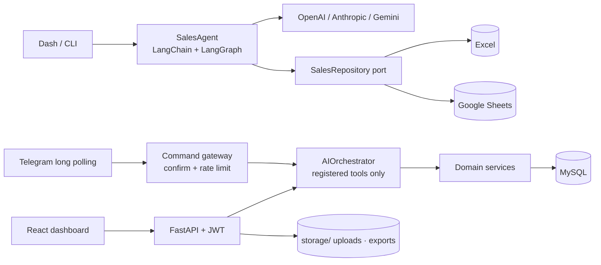

# OPERATIX
**Conversational transaction agent — natural-language sales requests to validated, idempotent writes**  
*The LLM only proposes tool arguments; a typed domain layer validates them, owns identifiers and performs every write.*


---

### Overview
> Converts messages such as *"5 laptops for $2500 for customer Juan Perez"* into structured sales records. Model output is treated as untrusted input: Pydantic validates tool arguments, the application generates transaction IDs, prices come from the product catalog and every write is idempotent. The same domain is reachable from Dash/CLI, a FastAPI + React dashboard and a Telegram channel that requires explicit confirmation.

---

### Key Engineering Decisions / Architecture
- **Model proposes, domain executes:** `register_sale` / `create_sale` receive Pydantic-validated arguments; the model never writes and never chooses IDs. `AIOrchestrator` executes only tools present in its registry and checks the caller's permission (`CREATE`, `READ`, `REPORTS`, `EXPORT`).
- **Idempotency by contract:** `POST /api/v1/sales` requires an `Idempotency-Key` (8–255 chars) and stores a hash of the command. Same key + same payload returns the existing sale; same key + different payload returns a conflict. The agent flow also de-duplicates repeated tool calls with a per-request UUID.
- **Single-transaction sale:** the authoritative product price is read, stock is validated and decremented, and the audit entry is written in one SQLAlchemy transaction.
- **Currency isolation:** reports aggregate per currency code; USD and PEN are never summed. `$` → USD and `S/` → PEN when no code is given; an amount is a total unless the text says "each / per unit".
- **Spreadsheet safety:** uploads (`.xlsx/.csv/.tsv`) are stored on disk with server-generated names; MySQL keeps only metadata, SHA-256 and an opaque path. Previews are read-only, capped at 5,000 rows and reject formulas; exports contain no formulas and neutralise formula-like strings (CSV/Excel injection).
- **Hexagonal persistence:** `SalesRepository` port with Excel and Google Sheets adapters, so the agent is independent of storage; MySQL is the transactional store of the API.
- **Auth model:** Argon2 hashes (`pwdlib`), short-lived JWT carrying only the user ID, roles re-loaded from the database on every request; registration always creates `USER`. Secrets and tokens are never written to `audit_logs`.
- **Telegram channel:** Bot API long polling behind a channel port; `TelegramCommandGateway` accepts structured commands only, binds `/confirmar` to the originating chat and rate-limits per window.



---

### Tech Stack
| Layer | Technologies |
| :--- | :--- |
| **LLM / agent** | `LangChain` · `LangGraph` · `langchain-openai` · `langchain-anthropic` · `langchain-google-genai` · `Pydantic 2` |
| **API** | `FastAPI` · `Uvicorn` · `PyJWT` · `pwdlib[argon2]` · `python-multipart` |
| **Persistence** | `SQLAlchemy 2` · `Alembic` · `PyMySQL` · `MySQL Community` · `openpyxl` · `gspread` |
| **Interfaces** | `Dash` · `Plotly` · `React 19` · `TypeScript` · `Vite` · `Tailwind CSS 4` · `Recharts` |
| **Tooling** | `uv` · `Hatchling` · `pytest` · `pytest-cov` · `Ruff` · `Docker Compose` |

---

### Quickstart
Requirements: Python 3.12–3.14, [`uv`](https://docs.astral.sh/uv/); Docker for MySQL; Node.js for the dashboard.

```powershell
uv sync
Copy-Item .env.example .env.local          # set one provider key; MYSQL_*; JWT_SECRET (>= 32 random chars)

uv run operatix-web                        # Dash UI  -> http://127.0.0.1:8050
uv run operatix "Agrega una venta de 5 laptops por $2500 para el cliente Juan Perez" --provider openai

docker compose --env-file .env.local up --build
uv run alembic upgrade head                # API -> http://127.0.0.1:8000/api/v1/health

cd frontend; npm install; npm run dev      # dashboard -> http://localhost:5173
```

Checks (offline — no cloud calls in tests):

```powershell
uv run ruff check .
uv run ruff format --check .
uv run python -m pytest
cd frontend; npm run build
```

| Component | State |
| :--- | :--- |
| Agent (Dash/CLI) · Excel/Sheets adapters | Implemented, unit-tested |
| API: auth, RBAC, audit, sales domain, files, reports | Implemented, tested |
| React dashboard | Implemented; browser tests pending |
| Telegram gateway | Implemented, unit-tested; auto-start polling worker pending |
| Production deployment | Out of MVP scope |

Full usage, endpoint list and troubleshooting: [docs/PROJECT_GUIDE.md](docs/PROJECT_GUIDE.md) · [Architecture](docs/ARCHITECTURE.md) · [Configuration](docs/CONFIGURATION.md) · [Development](docs/DEVELOPMENT.md) · [Installation](docs/INSTALLATION.md)

---

### License
Source-available under the [PolyForm Noncommercial License 1.0.0](LICENSE) — not an OSI-approved open source license.

> Source code is available under the PolyForm Noncommercial License 1.0.0. Commercial use requires a separate license from the copyright holder.

Commercial use: [COMMERCIAL-LICENSE.md](COMMERCIAL-LICENSE.md).

Required Notice: Copyright (c) 2026 FerS00 (https://github.com/FerS00)

**Author:** [FerS00](https://github.com/FerS00)
