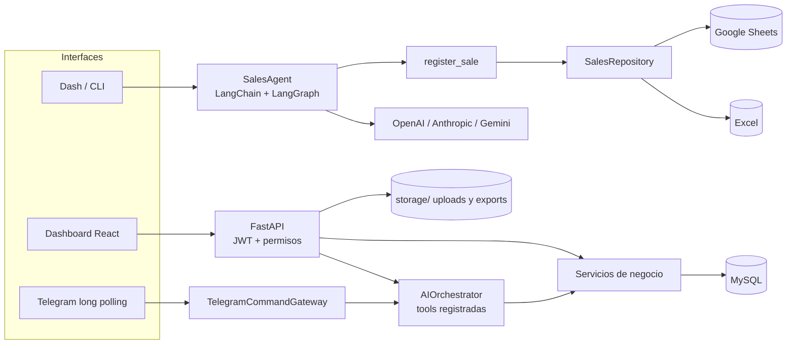

# OPERATIX

Agente conversacional que convierte pedidos escritos en lenguaje natural en transacciones
de venta estructuradas. El modelo de lenguaje solo propone argumentos para herramientas
(tool calling); el dominio los valida y es la aplicación quien escribe en Excel, Google
Sheets o MySQL.

> **Estado: MVP en desarrollo — Fase 5 en validación local.** Las Fases 1–4, el dashboard
> React y el gateway de Telegram (con confirmación y rate limit) están implementados. El
> flujo Dash/CLI original sigue disponible. Quedan pendientes las pruebas de navegador y
> el worker que arranca el polling de Telegram de forma automática. No hay despliegue
> productivo.

## Características

**Agente y flujo original (Dash / CLI)**

- Chat local con Dash y CLI (`operatix`, `operatix-web`).
- Proveedores de IA intercambiables: OpenAI, Anthropic y Google Gemini, vía LangChain sobre
  LangGraph.
- Tool calling validado con Pydantic: el modelo nunca escribe directamente.
- Persistencia en Excel local o, opcionalmente, Google Sheets.
- Identificador de transacción generado por la aplicación e idempotencia por solicitud.
- Resumen de transacciones, unidades e importes con Plotly.

**API de negocio (FastAPI + MySQL)**

- Usuarios, roles, permisos, hash Argon2, JWT y registro de auditoría.
- Clientes, productos, inventario y ventas con migraciones Alembic.
- `AIOrchestrator` que solo ejecuta tools registradas; `create_sale` usa el precio
  almacenado del producto, descuenta inventario en la misma transacción y exige
  `Idempotency-Key`.
- Subida de archivos `.xlsx`/`.csv`/`.tsv` con metadatos y SHA-256 en MySQL y binarios en
  disco; vista previa acotada y de solo lectura.
- Reportes de ventas agrupados por moneda y exportación a Excel sin fórmulas.
- Dashboard React + TypeScript + Tailwind + Recharts.
- Adaptador de Telegram (Bot API, long polling) con comandos estructurados, confirmación
  explícita (`/confirmar`) y límite de solicitudes.

## Arquitectura

Monolito modular, con límites claros entre dominio, aplicación, adaptadores y canales.



Decisiones técnicas principales:

- **El modelo propone, la aplicación ejecuta.** Los argumentos del tool call se validan con
  Pydantic; el identificador y la escritura los controla el dominio.
- **Puerto único de persistencia** (`SalesRepository`) para cambiar Excel/Sheets por una base
  de datos sin reescribir el agente.
- **Idempotencia explícita.** Repetir una `Idempotency-Key` con los mismos datos devuelve la
  venta existente; reutilizarla con datos distintos devuelve conflicto.
- **Monedas separadas.** Los reportes agrupan por código de moneda; nunca suman USD con PEN.
- **Exportaciones seguras para Excel.** Los libros exportados no contienen fórmulas y los
  textos que podrían interpretarse como fórmula se neutralizan.
- **Binarios fuera de la base de datos.** MySQL guarda solo metadatos, hash y una ruta
  opaca generada por el servidor.

Más detalle en [docs/ARCHITECTURE.md](docs/ARCHITECTURE.md).

## Tecnologías

| Área | Tecnologías |
|---|---|
| Lenguaje y entorno | Python 3.12–3.14, `uv`, Hatchling |
| IA | LangChain, LangGraph, `langchain-openai`, `langchain-anthropic`, `langchain-google-genai` |
| API | FastAPI, Uvicorn, Pydantic, PyJWT, pwdlib (Argon2) |
| Datos | SQLAlchemy 2, Alembic, PyMySQL, MySQL Community (Docker) |
| Hojas de cálculo | openpyxl, gspread (Google Sheets) |
| Interfaces | Dash, Plotly, React 19, TypeScript, Vite, Tailwind CSS 4, Recharts |
| Calidad | pytest, pytest-cov, Ruff |
| Contenedores | Docker, Docker Compose |

## Estructura

```text
backend/app/           API FastAPI: rutas, seguridad, modelos, servicios, tools y canales
backend/alembic/       Migraciones de base de datos
frontend/              Dashboard React + TypeScript + Tailwind + Recharts
src/operatix/
├── application/       Casos de uso, agente y selección de repositorios
├── domain/            Modelos y reglas de ventas
├── infrastructure/    Adaptadores Excel y Google Sheets
├── llm/               Proveedores OpenAI, Anthropic y Gemini
├── ports/             Contratos de persistencia
└── presentation/      CLI, aplicación Dash y dashboard
storage/               Directorios de uploads/exports (contenido ignorado por Git)
tests/                 Pruebas unitarias y del flujo LangGraph sin consumo cloud
docs/                  Arquitectura, configuración, desarrollo, instalación y herramientas
```

## Instalación y desarrollo

Requisitos: Python 3.12–3.14 y [`uv`](https://docs.astral.sh/uv/). Para la API con base de
datos, Docker Desktop. Para el dashboard, Node.js y npm.

```powershell
uv sync
Copy-Item .env.example .env.local
```

Completa en `.env.local` solo la clave del proveedor que vayas a usar. `.env.local` está
excluido de Git. Una suscripción de ChatGPT no incluye saldo de API; OpenAI Platform
necesita facturación o cuota propia.

### Interfaz Dash

```powershell
uv run operatix-web
```

Abre `http://127.0.0.1:8050`. La opción de introducir una clave temporal en la UI es
apropiada únicamente para una ejecución local de un solo usuario.

### CLI

```powershell
uv run operatix "Agrega una venta de 5 laptops por $2500 para el cliente Juan Perez" --provider openai
```

Por defecto se crea `data/operatix.xlsx`. En el ejemplo `$2500` se interpreta como total
porque no se indicó “cada una”: se guardan precio unitario `500.00` y total `2500.00`.

### API y MySQL

Sin Docker:

```powershell
uv run uvicorn backend.app.main:app --reload
```

`http://127.0.0.1:8000/api/v1/health` responde sin base de datos; `/api/v1/health/ready`
requiere MySQL.

Con Docker Compose (tras cambiar las contraseñas locales en `.env.local`):

```powershell
docker compose --env-file .env.local up --build
uv run alembic upgrade head
```

### Dashboard React

```powershell
cd frontend
npm install
npm run dev
```

Abre `http://localhost:5173`. Usa `http://127.0.0.1:8000/api/v1` por defecto; para otra URL
crea `frontend/.env.local` con `VITE_API_URL=...`.

La instalación completa en una PC de prueba, la prueba funcional y la desinstalación están
en [docs/INSTALLATION.md](docs/INSTALLATION.md).

## Configuración

Todas las variables están en [`.env.example`](.env.example) con valores de ejemplo y se
explican en [docs/CONFIGURATION.md](docs/CONFIGURATION.md).

| Proveedor | Variable de clave | Variable de modelo |
|---|---|---|
| OpenAI | `OPENAI_API_KEY` | `OPENAI_MODEL` |
| Anthropic | `ANTHROPIC_API_KEY` | `ANTHROPIC_MODEL` |
| Google Gemini | `GOOGLE_API_KEY` | `GOOGLE_MODEL` |

Otras variables relevantes: `MYSQL_*` / `DATABASE_URL`, `JWT_SECRET` (mínimo 32 caracteres
aleatorios), `OPERATIX_STORAGE_*`, `TELEGRAM_BOT_TOKEN` (opcional) y `GOOGLE_SHEETS_*`
(opcional). Los nombres de modelo son configurables porque su disponibilidad depende de
cada cuenta.

### Google Sheets (opcional)

1. Crea una cuenta de servicio en Google Cloud y habilita Google Sheets API.
2. Guarda su JSON en `.secrets/google-service-account.json` (directorio ignorado por Git).
3. Comparte la hoja con el correo de la cuenta de servicio.
4. Define `GOOGLE_SHEETS_SPREADSHEET_ID` en `.env.local`.
5. Selecciona `Google Sheets` en la interfaz o usa `--backend google_sheets`.

## API

Autenticación y seguridad (Fase 2). El registro siempre crea un usuario `USER`; los roles
privilegiados no se aceptan desde el cliente.

```text
POST /api/v1/auth/register
POST /api/v1/auth/login
GET  /api/v1/auth/me
GET  /api/v1/security/read-check
GET  /api/v1/security/admin-check
GET  /api/v1/security/audit           (ADMIN)
```

Negocio (Fase 3):

```text
POST /api/v1/customers          (CREATE)
GET  /api/v1/customers          (READ)
POST /api/v1/products           (CREATE)
GET  /api/v1/products           (READ)
GET  /api/v1/inventory          (READ)
PUT  /api/v1/inventory/{id}     (UPDATE)
POST /api/v1/sales              (CREATE + Idempotency-Key de 8 a 255 caracteres)
GET  /api/v1/sales              (READ)
GET  /api/v1/sales/summary      (REPORTS)
```

Archivos y reportes (Fase 4). Se aceptan `.xlsx`, `.csv` y `.tsv`; la vista previa está
acotada a 5.000 filas y rechaza fórmulas en los datos de entrada.

```text
POST /api/v1/files/upload                (CREATE, multipart/form-data)
GET  /api/v1/files                       (READ)
POST /api/v1/files/{id}/excel/preview    (READ)
GET  /api/v1/files/{id}/download         (READ)
GET  /api/v1/reports/sales/summary       (REPORTS)
POST /api/v1/reports/sales/export        (EXPORT)
```

### Reglas de interpretación de ventas (flujo del agente)

- El texto debe contener cliente, producto, cantidad e importe; si falta un dato, el agente
  debe pedirlo antes de escribir.
- Un importe se considera **total** salvo que el usuario diga “cada uno”, “por unidad” o
  “precio unitario”.
- `$` se interpreta como USD y `S/` como PEN cuando no se especifica otro código.
- Cada solicitud genera su propio UUID; una repetición interna del mismo tool call no
  duplica la fila.

## Pruebas y calidad

```powershell
uv run ruff check .
uv run ruff format --check .
uv run python -m pytest
cd frontend; npm run build
```

Las pruebas no consumen proveedores cloud: el flujo LangGraph se prueba con dobles locales.
El proyecto también usa un análisis opcional con Semgrep
(`semgrep scan --config p/python --config p/security-audit backend src tests`).
Guía completa en [docs/DEVELOPMENT.md](docs/DEVELOPMENT.md).

## Seguridad

- Las claves y tokens se leen de variables de entorno (`.env.local`, excluido de Git).
- Contraseñas con Argon2; JWT de corta duración que solo contiene el identificador del
  usuario, y cada request recarga usuario y roles desde la base de datos.
- Contraseñas, tokens y secretos nunca se escriben en `audit_logs`.
- En Telegram, una venta requiere `/confirmar`, la confirmación está ligada al chat y hay
  rate limit por ventana.

Límites conocidos del MVP:

- La clave temporal introducida en la UI de Dash es solo para uso local de un usuario.
- No existe todavía aprobación humana para montos altos.
- Excel y Google Sheets no son adecuados para alta concurrencia.
- No hay webhook público ni despliegue productivo.
- El JWT del dashboard se conserva en `sessionStorage`.

## Solución de problemas

- **OpenAI responde `insufficient_quota`:** la clave llegó a OpenAI, pero el proyecto no tiene
  saldo o alcanzó su límite de gasto. La suscripción de ChatGPT y la facturación de API son
  independientes.
- **La venta no aparece en Google Sheets:** comprueba que Sheets API esté habilitada, que el ID
  sea correcto y que la hoja esté compartida con el `client_email` de la cuenta de servicio.
- **Excel está abierto en otra aplicación:** ciérralo antes de procesar otra operación; Excel
  puede bloquear la escritura del archivo.

## Estado

| Componente | Estado |
|---|---|
| Agente Dash/CLI con Excel y Google Sheets | Implementado, con pruebas unitarias |
| API FastAPI: auth, roles, auditoría | Implementado, con pruebas |
| Dominio MySQL, orquestador de tools, idempotencia | Implementado, con pruebas |
| Archivos, vista previa y reportes por moneda | Implementado, con pruebas |
| Dashboard React | Implementado; pruebas de navegador pendientes |
| Canal Telegram (gateway, confirmación, rate limit) | Implementado, con pruebas unitarias |
| Worker automático de polling de Telegram | Pendiente |
| Despliegue productivo | Fuera del alcance del MVP |

## Documentación

- [Arquitectura](docs/ARCHITECTURE.md)
- [Configuración y seguridad](docs/CONFIGURATION.md)
- [Guía de desarrollo](docs/DEVELOPMENT.md)
- [Instalación y desinstalación](docs/INSTALLATION.md)
- [Herramientas recomendadas](docs/TOOLING.md)
- [Contexto del proyecto para agentes](PROJECT_CONTEXT.md)

## Licencia

Código **source-available** bajo la [PolyForm Noncommercial License 1.0.0](LICENSE). No es
software open source aprobado por la OSI.

> Source code is available under the PolyForm Noncommercial License 1.0.0. Commercial use
> requires a separate license from the copyright holder.

Ver [COMMERCIAL-LICENSE.md](COMMERCIAL-LICENSE.md) para usos comerciales.

Required Notice: Copyright (c) 2026 FerS00 (https://github.com/FerS00)

## Autor

[FerS00](https://github.com/FerS00)
