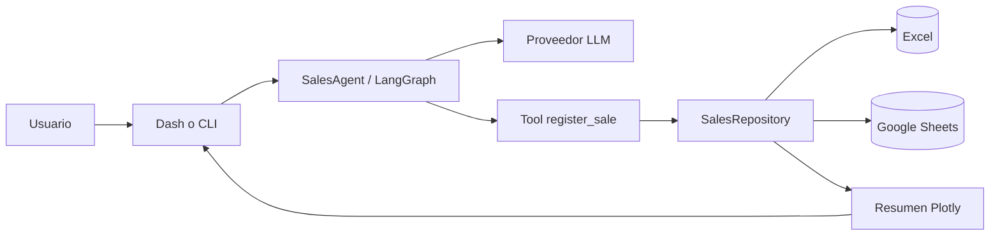

# Arquitectura técnica

OPERATIX usa un monolito modular. Para un solo programador es más fácil de ejecutar,
probar y desplegar que varios servicios, pero conserva límites que permiten sustituir
cada integración.



## Decisiones

- **Monolito modular:** una aplicación y un proceso para el MVP.
- **Dominio independiente:** `SaleCommand` y `SaleRecord` no conocen Dash, LangChain,
  Excel ni Google.
- **Puerto único de persistencia:** `SalesRepository` permite cambiar hojas por una base
  de datos posteriormente sin reescribir el agente.
- **Tool calling con efecto controlado:** el modelo propone argumentos validados; solo la
  herramienta escribe. El ID lo genera la aplicación, no el modelo.
- **Multiproveedor:** las credenciales y nombres de modelo se resuelven en el borde.
- **Excel primero:** reduce configuración y permite validar el flujo completo antes de
  depender de OAuth, cuotas y permisos de Google.

## Estructura

```text
OPERATIX/
├── src/operatix/
│   ├── application/       # Casos de uso, agente y selección de repositorio
│   ├── domain/            # Reglas y modelos transaccionales
│   ├── infrastructure/    # Excel y Google Sheets
│   ├── llm/               # Adaptadores OpenAI, Anthropic y Gemini
│   ├── ports/             # Contratos de persistencia
│   └── presentation/      # CLI, Dash y dashboard Plotly
├── tests/                 # Pruebas sin llamadas pagadas
├── docs/                  # Arquitectura y herramientas
├── data/                  # Libros locales ignorados por Git
├── .env.example
└── pyproject.toml
```

## Siguientes incrementos

1. Confirmación humana antes de operaciones sensibles o montos altos.
2. Webhook autenticado para WhatsApp, Telegram, Slack o Teams; elegir solo un canal.
3. Trazas y evaluaciones con LangSmith, incluyendo casos ambiguos y duplicados.
4. Dashboard con filtros de fecha, producto, cliente y moneda.
5. Solo cuando las hojas sean insuficientes: migración del adaptador a Postgres.
