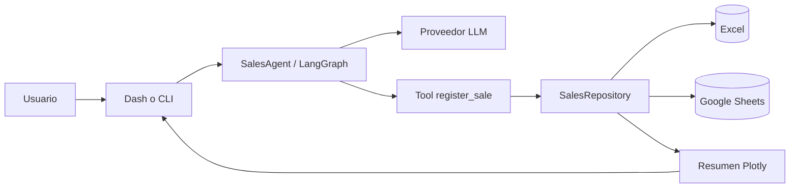
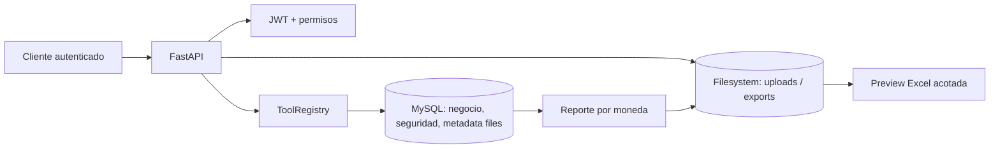

# Arquitectura técnica

OPERATIX usa un monolito modular. Para un solo programador es más fácil de ejecutar,
probar y desplegar que varios servicios, pero conserva límites que permiten sustituir
cada integración.



El backend FastAPI actual añade el flujo transaccional siguiente:



## Decisiones

- **Monolito modular:** una aplicación y un proceso para el MVP.
- **Dominio independiente:** `SaleCommand` y `SaleRecord` no conocen Dash, LangChain,
  Excel ni Google.
- **Puerto único de persistencia:** `SalesRepository` permite cambiar hojas por una base
  de datos posteriormente sin reescribir el agente.
- **Tool calling con efecto controlado:** el modelo propone argumentos validados; solo la
  herramienta escribe. El ID lo genera la aplicación, no el modelo.
- **Multiproveedor:** las credenciales y nombres de modelo se resuelven en el borde.
- **Migración incremental a MySQL:** Excel y Google Sheets siguen disponibles durante la
  transición, pero MySQL será la base transaccional del producto final. Excel quedará para
  importación, exportación y procesamiento de archivos.

## Fase 1 de plataforma

La rama `feat/operatix-mvp-main` incorpora una base FastAPI, SQLAlchemy y Alembic sin
acoplar todavía el dominio de ventas a la base de datos. Docker Compose levanta MySQL
Community local y la API expone `/api/v1/health` y `/api/v1/health/ready`. Las tablas de
negocio se añadirán en la fase de dominio, con migraciones versionadas.

## Fase 2 de seguridad

La API incorpora usuarios, roles, permisos, JWT de corta duración y auditoría. El token
solo contiene el identificador del usuario; cada request vuelve a cargar el usuario y sus
roles desde la base de datos. El endpoint de registro solo asigna `USER`, y las rutas
protegidas usan dependencias de autorización reutilizables. Las operaciones de negocio y
las confirmaciones destructivas se completarán junto con las tools y los flujos de dominio.

## Fase 3 de dominio y orquestador

MySQL ahora contiene clientes, productos, inventario y ventas. El servicio de ventas usa
el precio almacenado del producto, valida stock, descuenta inventario y registra una
auditoría en una única transacción. Cada venta exige una clave de idempotencia y guarda un
hash del comando para rechazar reintentos con datos diferentes.

`AIOrchestrator` delega únicamente a tools registradas en `ToolRegistry`, comprueba el
permiso requerido y limita cada instancia a una llamada. En esta fase las tools son
estructuradas y deterministas; el adaptador LLM que interprete lenguaje natural se
conectará después, sin darle acceso directo a SQLAlchemy.

## Fase 4 de archivos y reportes

Los archivos no se almacenan como blobs en MySQL. `FileStorage` valida extensión, limita
el tamaño, escribe de forma atómica y resuelve exclusivamente rutas relativas bajo la
raíz configurada. `FileRecord` permite auditoría y descarga autenticada. La vista previa
Excel solo inspecciona encabezados y filas acotadas; todavía no ejecuta importaciones de
ventas, por lo que no puede modificar inventario de forma accidental.

Los reportes agregan por moneda y exportan un libro de dos hojas sin fórmulas. Las cadenas
que empiezan por `=`, `+`, `-` o `@` se neutralizan antes de entrar al libro para evitar
inyección de fórmulas.

## Estructura

```text
OPERATIX/
├── src/operatix/
│   ├── application/       # Casos de uso, agente y selección de repositorio
│   ├── domain/            # Reglas y modelos transaccionales
│   ├── infrastructure/    # Excel y Google Sheets
│   ├── llm/               # Adaptadores OpenAI, Anthropic y Gemini
│   ├── ports/             # Contratos de persistencia
│   └── presentation/      # CLI, Dash y dashboard Plotly
├── tests/                 # Pruebas sin llamadas pagadas
├── docs/                  # Arquitectura y herramientas
├── data/                  # Libros locales ignorados por Git
├── .env.example
└── pyproject.toml
```

## Siguientes incrementos

1. Confirmación humana antes de operaciones sensibles o montos altos.
2. Completar conversación multironda y conectar el adaptador LLM al orquestador.
3. Completar importación confirmada de filas Excel hacia clientes/productos/ventas.
4. Dashboard React y Telegram después de estabilizar la API.
